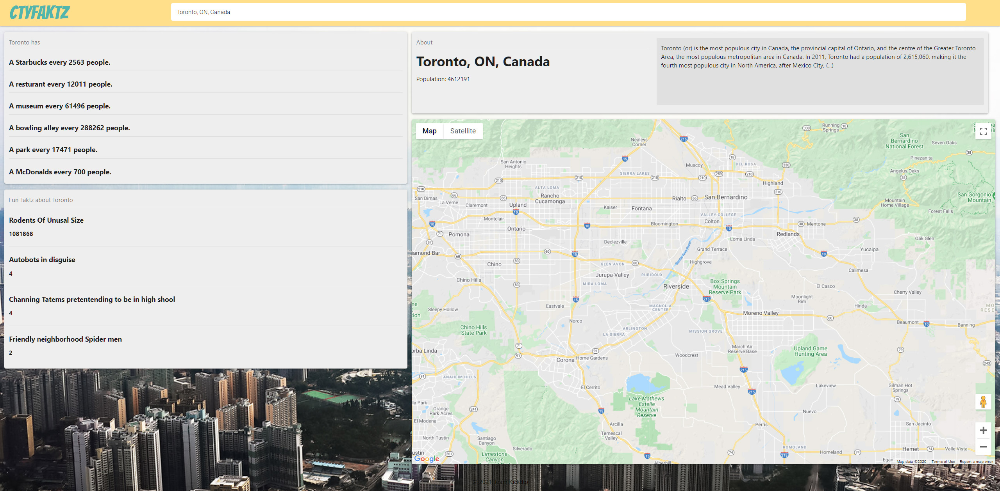

Developers: Eric Hunter, Joseph Grant, David Johnson, Sharif Alsalahat, Alejandro Ramirez and C.T. Bell

# ctyFaktz

Ever wondered if a city is right for you? Look no further than ctyFaktz; city research made fun!

## How it works:

Search for a city and ctyFaktz will pull from multiple sources to display useful and fun facts about the city.

# Link to Live Site

[Live Site](https://charlestbell.github.io/ctyFaktz/)

# Features

- City Facts are calculated live based on real population and yelp data.
- Fun facts update live based on population
- Mobile Responsiveness
- A short city bio from wikipedia gives you peace of mind that you searched the right place
- A landing page for some pizzazz
- A reassuring loading bar while you wait

## Upcoming Features

- Custom Per Capita search
- % of McDonald's Ice Cream Machines working by city

### Screenshots

Landing Page

Results Page

